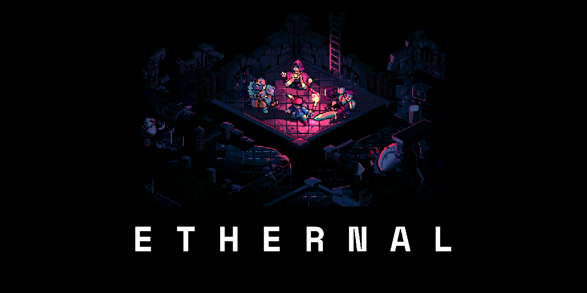

This is the code repository for [Ethernal](https://ethernal.world), an [ethereum](https://ethereum.org)-based game running fully on-chain built by [@Ohjia](https://github.com/Ohjia), [@lumir-mrkva](https://github.com/lumir-mrkva), [@gleuch](https://github.com/gleuch) and [@wighawag](https://github.com/wighawag) (Ethernal's original creator, whose early prototype can be found [here](https://github.com/wighawag/the_eternal_dungeon)).

---

Development of the game stopped in the fall of 2020 but you'll find the source code of its last iteration in this repo.

The game is composed of three primary modules:

- **[contracts](contracts/)** - responsible for game rules and data storage
- **[backend](backend/)** - caches and synchorizes data between front-end & contracts, built on NodeJS
- **[webapp](webapp/)** - provides user interface for players, built on Svelte

The whole app can be started locally by deploying local `contracts` first and then running `backend` and `webapp`.
    
Alternatively the `webapp` can be started to connect to the already deployed staging or production contracts on Matic Mumbai network.

## License

The code is licensed as MIT, see [LICENSE](./LICENSE) file.

## TO PLAY WITH IT

- `cd ethernal`

- `npm i`

- open 3 consoles
  
  - in the first do  `npm run contracts`
  - after contracts are deployed, in the second, do `npm run backend`
  - then after the backend succesfuly start, in the third console, do: `npm run webapp`

- open your browser at : `http://localhost:8080/#dungeonKey=0xee817c4bd0ed417a07bd49b8d94efaf58ed75897c4059846fa9bcf564f59cd4c`

Note you need to have metamask installed and it must be connected to `localhost:8545`
You also need to reset your account (metamask cache data across network with same chainId (localhost:8545))
